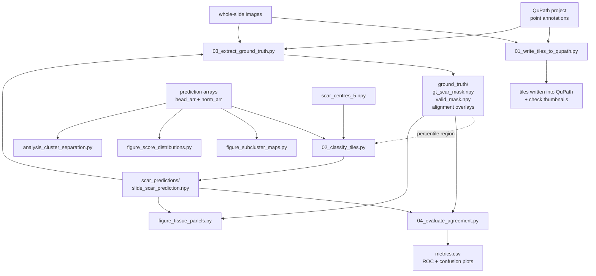

# Scar quantification in whole-slide histology

Tile-level classification of scar tissue in whole-slide images, scored against
expert annotations drawn in QuPath.

## The two evaluations

The write-up reports two paired configurations, and both are reproducible here.
They are *paired*: each decision rule was scored over its own region
definition, and mixing them gives numbers matching neither table.

| | `SCAR_EVALUATION=baseline` | `SCAR_EVALUATION=threshold` |
| --- | --- | --- |
| Decision rule | `argmax == scar` | percentile rank > `PCT_THRESHOLD` |
| Scored region | padded bounding box around the annotation points | connected tissue piece carrying the GT |
| Sensitivity | 0.505 | 0.700 |
| Specificity | 0.953 | 0.772 |
| Precision | 0.950 | 0.627 |
| Balanced accuracy | 0.729 | 0.736 |

Sensitivity is directly comparable between the columns: the ground-truth
positive population is identical under both region definitions (78,586 tiles).
Specificity and precision are not, since the negative population changes with
the region.

Set the variable before running anything:

```bash
SCAR_EVALUATION=baseline python 02_classify_tiles.py && SCAR_EVALUATION=baseline python 04_evaluate_agreement.py
SCAR_EVALUATION=threshold python 02_classify_tiles.py && SCAR_EVALUATION=threshold python 04_evaluate_agreement.py
```

Scar predictions go to `scar_predictions/<evaluation>/` and metrics to
`outputs/metrics_out/<evaluation>/`, so one arm never overwrites the other.
`threshold` is the default when the variable is unset.

## How a tile is classified

Each slide is divided into 224 px tiles. A classification head gives every tile
a four-class score (artefact / normal / scar / peri) and an embedding vector. A
tile is called scar when both of the following hold:

1. its raw scar score sits above a percentile threshold, computed within the
   annotated region of that slide, and
2. its nearest of five scar sub-cluster centroids is one of the three retained
   as scar (the other two are epidermis-like).

The scripts here build those calls, compare them to the ground truth, and
produce the figures.

## Pipeline



Filenames follow a convention: `NN_` for the numbered pipeline steps, which
run in order; `analysis_` for the analyses behind the reported findings; and
`figure_` for scripts whose output is a figure. `config.py`, `metrics.py` and
`annotations.py` are imported by the others and are not run directly.

| Script | Role |
| --- | --- |
| `01_write_tiles_to_qupath.py` | Traces the QuPath point annotations, writes one tile object per enclosed tile back into the project, and renders a thumbnail with those tiles drawn on for visual checking. The only script that modifies the QuPath project. |
| `02_classify_tiles.py` | Classifies every tile, writes one scar prediction and preview per slide. Backs up any previous run first. |
| `03_extract_ground_truth.py` | Converts QuPath point annotations into ground-truth tile masks, defines the scored region, reports TP/FP/FN/TN and IoU, writes alignment overlays. |
| `figure_tissue_panels.py` | Per-slide figure: tissue, ground truth, algorithm, alignment. Also a combined all-slides plate. |
| `figure_subcluster_maps.py` | Sub-cluster identity maps, one per slide plus a 2 x 3 plate. |
| `figure_score_distributions.py` | KDE of the raw scar score split by outcome (TP/FP/FN/TN), pooled and per slide. |
| `analysis_cluster_separation.py` | Silhouette scores and PCA panels for macro clusters, sub-clusters and ground truth. Diagnostic only. |
| `04_evaluate_agreement.py` | The headline numbers: TP/FP/FN/TN, accuracy, sensitivity, specificity, precision, IoU, Dice, balanced accuracy, F1 and ROC AUC, per slide and pooled. Writes `metrics.csv`. |
| `05_calibrate_threshold.py` | Derives the operating point. Sweeps candidate thresholds, compares the argmax rule against the percentile ROC curve at matched sensitivity, and reports every slide at every candidate. Nothing else re-derives `PCT_THRESHOLD`. |
| `analysis_cluster_composition.py` | Composition of the five sub-clusters across the scored region — the numbers behind Table 3. |
| `analysis_outlier_removal.py` | Outlier removal end to end: IsolationForest and LOF at three contamination levels, both cluster levels, with GT metrics, silhouette and the spatial structure of the removed tiles. |
| `figure_error_map.py` | Per-tile TP/FP/FN/TN map in original spatial position, to check whether errors are spatially concentrated. |
| `analysis_missed_scar_centroid_check.py` | Validity check on the macro-centroid labelling: applies the nearest-centroid assignment to confirmed true positives. Run before the two scripts below. |
| `analysis_missed_scar_location.py` | Which region of embedding space the missed tiles occupy, by nearest macro centroid. |
| `analysis_missed_scar_stage.py` | Which pipeline stage discarded each missed tile — candidate selection, or the sub-cluster filter. |
| `analysis_missed_scar_margin.py` | How narrowly the missed tiles lost, from the head's raw scores, plus which class won instead. |
| `annotations.py` | Shared helpers: ordering annotation points into an outline and filling it onto the tile grid. Imported by the two scripts above that read QuPath. Not run directly. |
| `metrics.py` | Shared scoring: loading the scored region, counting TP/FP/FN/TN, turning counts into metrics, and drawing ROC and confusion plots. Imported by every script that scores anything. Not run directly. |

One subfolder holds work that isn't part of the pipeline:

| Folder | Contents |
| --- | --- |
| `experiments/` | Alternative classification rules that were tried and measured (peripheral clusters, outlier pruning at two granularities), plus an alternative metrics report. Also where the macro-centroid-gated rule is produced, as the pre-pruning grid of the Task 5 script. See [experiments/README.md](experiments/README.md). |

### Order to run them

`02_classify_tiles.py` and `03_extract_ground_truth.py` each consume an output of
the other, so the first run needs a bootstrap:

1. `01_write_tiles_to_qupath.py` — once, to populate the QuPath project with tiles and
   check the traced outlines against the tissue. Nothing downstream reads its
   output files; it modifies the project and produces thumbnails for review, so
   skip it if the project already holds the tiles you want.
2. `SCAR_EVALUATION=baseline python 02_classify_tiles.py` — the baseline rule
   needs no ground truth (it gates on the head's argmax, not on a percentile
   ranked within a region), so it runs first and breaks the circular
   dependency between the two scripts.
3. `03_extract_ground_truth.py` — writes `*_gt_scar_mask.npy` and **both** region
   masks, `*_valid_mask_bbox.npy` and `*_valid_mask_component.npy`. It writes
   both regardless of `SCAR_EVALUATION`, so it never needs re-running when that
   choice changes.
4. `SCAR_EVALUATION=baseline python 04_evaluate_agreement.py` — Table 1.
5. `SCAR_EVALUATION=threshold python 02_classify_tiles.py`, then
   `SCAR_EVALUATION=threshold python 04_evaluate_agreement.py` — Table 2.
6. The figure and diagnostic scripts, in any order. They follow
   `SCAR_EVALUATION` too, so a figure always matches the arm it was built under.
7. `05_calibrate_threshold.py`, `analysis_cluster_composition.py`,
   `analysis_outlier_removal.py` and `figure_error_map.py`, under
   `SCAR_EVALUATION=threshold` — the calibration and composition figures were
   computed over the connected-component region.
8. The false-negative scripts, under `SCAR_EVALUATION=baseline` — that is the
   arm their reported figures come from. Run
   `analysis_missed_scar_centroid_check.py` first, since it establishes
   whether `analysis_missed_scar_location.py` can be read at face value.

Once the masks exist, later runs start at step 4 or 5.

## Installation

Requires Python 3.9 or newer.

```bash
python -m venv venv
source venv/bin/activate        # Windows: venv\Scripts\activate
pip install -r requirements.txt
```

Three scripts (`01_write_tiles_to_qupath.py`, `03_extract_ground_truth.py`,
`figure_tissue_panels.py`) read raw slides and QuPath annotations, which need
native software beyond pip:

- **OpenSlide** — <https://openslide.org/download/>. On Linux/macOS install the
  system package (`libopenslide`/`openslide`). On Windows download the binary
  release and point `OPENSLIDE_BIN_DIR` at its `bin` folder.
- **QuPath** — <https://qupath.github.io/>. Point `PAQUO_QUPATH_DIR` at the
  installation directory.

The other four scripts run on the `.npy` arrays alone and need neither.

## Configuration

No paths are hardcoded. `config.py` reads them from environment variables and
falls back to a `data/` folder inside the repository. The simplest setup is to
put everything under one directory:

```
data/
├── predictions/                  <slide>_scar_head_arr.npy, <slide>_scar_norm_arr.npy
├── ground_truth/                 written by 03_extract_ground_truth.py
│                                 (gt masks + both region definitions)
├── scar_predictions/baseline/         written by 02_classify_tiles.py
├── scar_predictions/threshold/        one subfolder per evaluation
├── slides/                       raw whole-slide images (.mrxs, .svs, ...)
├── qupath_project/project.qpproj
├── scar_centres_4.npy
├── scar_centres_5.npy
└── outputs/                      figures
```

and set one variable:

```bash
export SCAR_PROJECT_DIR=/path/to/data                 # Windows: set SCAR_PROJECT_DIR=...
```

Any folder can live elsewhere by setting its own variable instead:

| Variable | Default |
| --- | --- |
| `SCAR_PROJECT_DIR` | `./data` |
| `SCAR_MODEL_OUTPUT_DIR` | `$SCAR_PROJECT_DIR/predictions` |
| `SCAR_GT_DIR` | `$SCAR_PROJECT_DIR/ground_truth` |
| `SCAR_PREDICTION_DIR` | `$SCAR_PROJECT_DIR/scar_predictions` |
| `SCAR_SLIDE_DIR` | `$SCAR_PROJECT_DIR/slides` |
| `SCAR_OUTPUT_DIR` | `$SCAR_PROJECT_DIR/outputs` |
| `SCAR_QUPATH_PROJECT` | `$SCAR_PROJECT_DIR/qupath_project/project.qpproj` |
| `SCAR_CENTRES_4` / `SCAR_CENTRES_5` | `$SCAR_PROJECT_DIR/scar_centres_{4,5}.npy` |
| `SCAR_SLIDE_NAMES` | the six slides in `config.py`, comma-separated |
| `SCAR_EVALUATION` | `threshold` — set to `baseline` for the other arm |
| `OPENSLIDE_BIN_DIR` | unset (Windows only) |
| `PAQUO_QUPATH_DIR` | unset |

`.env.example` has a copy-pasteable block.

## Expected input arrays

Per slide, in the predictions folder:

- `<slide>_scar_head_arr.npy` — `(rows, cols, 4)` float. Classification-head
  scores per tile; channel 2 is scar. An all-zero tile means "no tissue".
- `<slide>_scar_norm_arr.npy` — `(rows, cols, D)` float. Normalised embedding
  per tile, in the same space as the centroid files.

Plus `scar_centres_5.npy` `(5, D)` and, for the diagnostic only,
`scar_centres_4.npy` `(4, D)`.

## Notes and caveats

- **`PCT_THRESHOLD` lives in `config.py`**, not in the script that applies it,
  because the calibration and cluster-composition scripts need the identical
  value — three separate copies had already drifted in precision.
  `05_calibrate_threshold.py` is what re-derives it.
- **`PCT_THRESHOLD = 0.561174086`** is the
  target-sensitivity-0.70 operating point, *not* the Youden-optimal cutoff.
  Youden-optimal was 0.506 (J = 0.483) but gave precision of only 0.598;
  0.561 gives up very little J (0.472) for a meaningfully better precision.
  It is fitted on the same six slides it was evaluated on, so it is an
  operating point rather than an independently validated cutoff — re-derive
  it before using it on a new cohort.
- **`PERCENTILE_REGION`** must be `"valid"` to reproduce the reported numbers.
  `"tissue"` works without any ground truth and is what makes an unannotated
  slide runnable, but the threshold was not validated against that region.
- **The rule and the region are paired, and `SCAR_EVALUATION` sets both
  together.** Running the argmax rule over the connected-component region (or
  the reverse) is possible by editing `EVALUATIONS` in `config.py`, but the
  result corresponds to neither reported table. Because the negative population
  differs between the regions, sensitivity is comparable across the two arms
  but specificity and precision are not.
- **`FLIP_VERTICALLY`** in `figure_tissue_panels.py` lists slides whose
  epidermis lands on the wrong side after the standard rotation. It is specific
  to this dataset and will need revisiting for new slides.
- **Sub-cluster indices are categorical**, not a severity scale. Grid values are
  `cluster_index + 1`, with 0 meaning "not scar".
- **The false-negative scripts mask by the valid region alone**, without also
  requiring a tile to contain tissue, which is the convention that analysis was
  run under. `04_evaluate_agreement.py` requires both. A ground-truth tile the model
  wrote no output for therefore counts as a false negative in the former and
  not the latter, so the two FN totals can differ slightly.
- **Pooled metrics pool the counts**, then compute rates from the total — they
  are not the mean of the per-slide rates, so each slide contributes in
  proportion to how many tiles it has.
- **ROC curves score the raw scar channel**, not the thresholded prediction, so
  the AUC does not move when the classification rule changes.
- `02_classify_tiles.py` copies any existing scar predictions into a timestamped
  folder before overwriting them.
- **`01_write_tiles_to_qupath.py` writes to your QuPath project** in append mode and
  clears each image's existing detections first. Back the project up before the
  first run. Every other script opens the project read-only or not at all.

## Data

No slide images, prediction arrays or annotations are included in this
repository, and `.gitignore` is set up to keep them out. Add nothing that
identifies a patient or animal subject.

Access to the whole-slide images, histologist annotations and model prediction
arrays may be available subject to permission from the original data owners.

## License

MIT — see [LICENSE](LICENSE).
